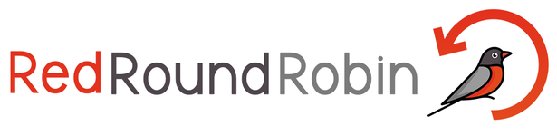
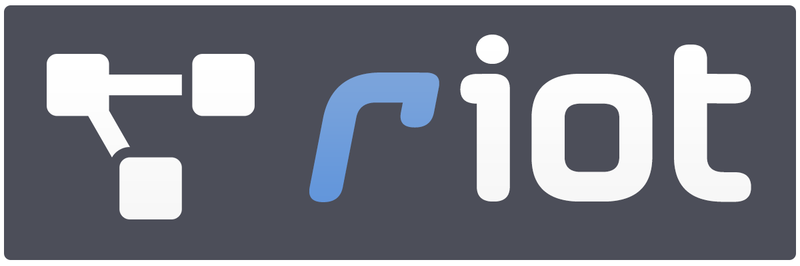

# RIoT

Progetto di Ingegneria del Software - ThiReMa Project (2019-2020)

Informatica, Università degli Studi di Padova

[www.redroundrobin.site](https://www.redroundrobin.site) - [Github](https://github.com/RedRoundRobin) - Gruppo 6

---

### Versione di prodotto

:fire: Versione corrente: `+b1.0`

### Git submodules 

| Sub-module | Cartella | Versione software  |
|---|---|---|
| [swe-docs](http://docs.redroundrobin.site) | `_documentazione/`    | `-`      |
| [swe-api](http://api.redroundrobin.site)   |       `api/`         | `v1.0.0-stable`  |
| [swe-gateway](http://gateway.redroundrobin.site) | `gateway/`     | `v1.0.0-stable`  |
| [swe-kafka-db](http://kafkadb.redroundrobin.site) | `kafka-db/`   | `v1.0.0-stable`  |
| [swe-webapp](http://webapp.redroundrobin.site) |    `webapp/`     | `v1.0.0-stable`  |
| [swe-telegram](http://telegram.redroundrobin.site) | `telegram/`  | `v1.0.0-stable`  |

 

### Licenza 

GNU General Public License v3.0

### Crediti

- Giuseppe Vito Bitetti
- Lorenzo Dei Negri
- Nicolò Frison
- Fouad Mouad
- Mariano Sciacco
- Alessandro Tommasin
- Giovanni Vidotto
